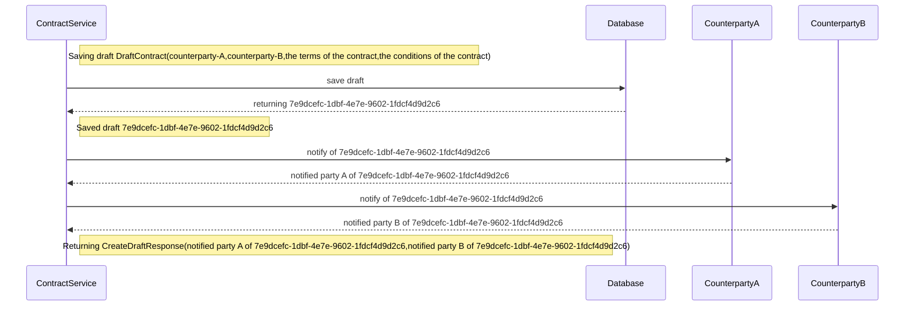

# Data Driven Development example

This project is an example of data-driven development.

The main take-away is the benefit of representing your program (control flow)
as data.

The benefits include:

1. Having a single point-of truth for describing your software, and deriving everything else.
   The agile manifesto evangelises working software over documentation., so this example demonstrates
   We still need documentation, however, so this example generates documentation (a sequence diagram) from the program logic

2. Being able to pass around your programs like data, for example to build bigger programs


# Sequence Diagram

The following diagram was generated from running this program (and then manually pasting it here).

You can regenerate it by running the project (as per below)



## Running

This project can be built using [scala-cli](https://scala-cli.virtuslab.org/):
```sh
scala-cli ./src/main/scala
```

or with [sbt](https://www.scala-sbt.org/):
```sh
sbt run
```

## Building

This project can be built using [scala-cli](https://scala-cli.virtuslab.org/):
```sh
scala-cli --power package ./src/main/scala --assembly -o app.jar
```

or with a zero-install docker build:
```sh
docker run --rm -v "${PWD}/src/main/scala:/home" virtuslab/scala-cli package /home --power --assembly -o /home/app.jar
```

or with [sbt](https://www.scala-sbt.org/):
```sh
sbt package
```