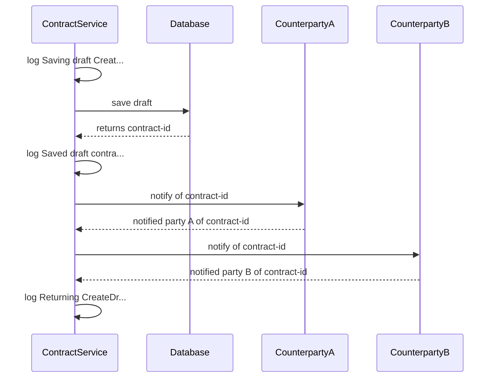
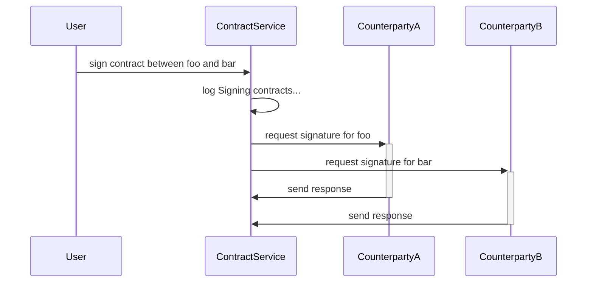
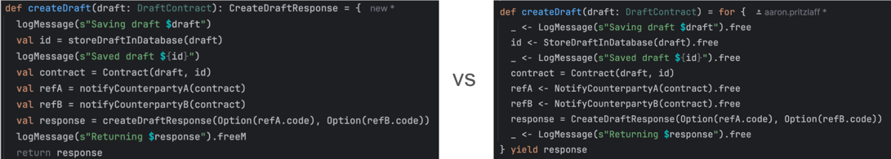
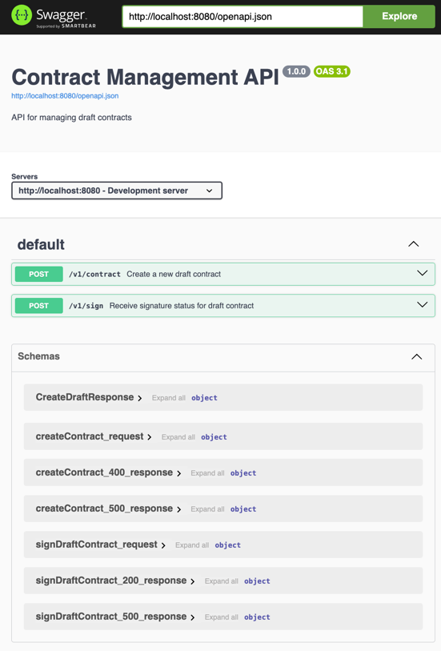

# Data Driven Development

This project is an example of data-driven development -- an approach which treats application flow as data,
which allows it to become the "single point of truth" (tm) for the business logic of your application.


# Benefits of This Approach 🎁
Representing the control flow of your application as data has many benefits:

### 🤩 A clear single point-of truth for your software flow
The [agile manifesto](https://agilemanifesto.org/) evangelises working software over documentation.
We still need documentation, however, so this example generates documentation (a sequence diagram) from the program logic

### 🚀 Composable Logic

Pass around your programs like data, which lets you compose/build bigger programs from small building-blocks

### ⭐ Reduced effort and faster feedback loops
Allow your stakeholders (product people, testers, etc) to play around with changes faster, and in a more
meaningful way, as the same code / logic which drives the backend can be visualised/tested in the browser.


# About this project

This project is for a made-up example of negotiating a draft contract between two counterparties.

There is a REST service which supports the upload of draft contracts, as well as a the means to then
request signatures for the contract.

This code repo would be the "single point of truth" which describes that flow as data.

That data is then used to:
### 1. 📊 Generate Sequence Diagrams 📊
Documentation quickly gets out-of-step with the working software. We also tend to overuse documentation because
it's typically quicker and easier to update than software.

This example demonstrates that **you can quickly update your application logic**, which then allows you to treat
the software itself as a verified (e.g. type-safe, compiled) form of documentation!

The sequence diagrams in this documentation were generated by the business logic (e.g. run `make generateDiagrams`) and then manually pasting it here:

### 2. ▶️ Execute the Business Logic ▶️
Because we're representing our application flow as data, it can also be executed! 🎉🎉🎉

Like [the other](https://github.com/aaronp/riffd) [examples](https://aaronp.github.io/freemonad/), we could make this
server-side code runnable in the browser for stakeholders to play around with.

Here we just show them running as [unit-tests](https://github.com/aaronp/counterparty/blob/d73143f4a6076ee09bf4c118d2966c1895eb91d7/src/test/scala/contract/CreateDraftLogicTest.scala#L25):


### 3. Governance / Change Management

Many people are familiar with versioning data schemas and service contracts.

Taking a data-driven approach to application flow/logic allows you to version and control your business logic changes
in the same way, which is a novel new approach.


# This Application Example

This application represents a counterparty contract service which allows two counterparties to share draft contracts, then optionally sign the proposed countract.

It has two workflows:

### Negotiate Draft Contract


### Enact Contract


In considering those workflows, the system will need to interact with the outside world (a database, and the downstream counterparties).

In a typical imperative approach, we might start defining interfaces. Here, we start by representing those operations as data

For example, our [Create Draft Logic](https://github.com/aaronp/counterparty/blob/main/src/main/scala/contract/CreateDraftLogic.scala#L11) has to do four things: store the draft, notify both counterparties, and log what it's doing:

```scala
  StoreDraftInDatabase(draft: DraftContract) 
  NotifyCounterpartyA(contract: Contract)
  NotifyCounterpartyB(contract: Contract)
  LogMessage(message: String)
```

Each of those operations has a return type as well - the result of operating on those instructions. 
When we encode those as data types, we do that in a way which captures their different return values.

You can do this in any language, but here we're using [scala3 enums](https://docs.scala-lang.org/scala3/reference/enums/enums.html):

```scala3
enum CreateDraftLogic[A]:
  case StoreDraftInDatabase(draft: DraftContract) extends CreateDraftLogic[DraftContractId]
  case NotifyCounterpartyA(contract: Contract) extends CreateDraftLogic[CounterpartyRef]
  case NotifyCounterpartyB(contract: Contract) extends CreateDraftLogic[CounterpartyRef]
  case LogMessage(message: String) extends CreateDraftLogic[Unit]
```

Now that we've captured what our system can do, we just need to sequence how we'll combine those operations.

Hint: It's going to look very similar to what you might expect if you were to write the business logic imperatively:



It basically looks the same, but wrapped in a ```for { ... }``` block where we've replaced `=` with `<-` and put a `.free` suffix on our [data structures](https://github.com/aaronp/counterparty/blob/main/src/main/scala/contract/CreateDraftLogic.scala#L11):

```scala
  def createDraft(draft: DraftContract) = for {
    _ <- LogMessage(s"Saving draft $draft").free
    id <- StoreDraftInDatabase(draft).free
    _ <- LogMessage(s"Saved draft ${id}").free
    contract = Contract(draft, id)
    refA <- NotifyCounterpartyA(contract).free
    refB <- NotifyCounterpartyB(contract).free
    response = CreateDraftResponse(Option(refA.code), Option(refB.code))
    _ <- LogMessage(s"Returning $response").free
  } yield response
```

It may look a little strange, but all that's doing is creating a tree data-structure akin to "do this, then do that. If this, then do that" 

### So What? 🤷

At this point let's notice what we have - namely the main points of our system:
 * ✅ The data structures
 * ✅ The operations (actions) we'll want to perform on that data
 * ✅ The business logic -- the flow of information in our system when we perform an action (like saving a draft contract)  

Notice what we've NOT done:
 * 🚫 we don't have any (zero!!!) dependencies. It's just data structures and flow
 * 🚫 We haven't had to mock anything, spin up any containers, etc. We CAN however compile this to prove it's correct (and our use of types can help us depending on how far we want to go)
 * 🚫 We've not coupled **WHAT** we do (the logic/flow) with **HOW** we do it (e.g. any specific database, REST client, etc)

### What have we done!?!? Why does this work?
When you typically write software using an imperative style, the underlying language (compiler) creates an abstract syntax tree (AST)
of your commands. Unless you're doing meta-programming, that AST is not available to you.

By using this approach, we've brought that AST into the user-space (read: made it available to us as engineers to do as we wish).

### So, what's next? 🤔 

Since our program is now represented as a tree data structure, we still have to DO something with it.

For that, we need to __interpret__ (or evaluate) our logic data structure. This is the point where it gets executed to produce some useful result.

By splitting this step, we have some interesting options:
 * we can perform "what if" scenarios -- evaluating our program flow on inputs without actually executing it
 * easily controlling (stubbing, limiting, logging, tracing, etc) actions per-operation
 * optimising / altering the flow based on inputs (think SQL query optimisations)
 * providing cross-platform implementations of the same logic (e.g targeting web and server-side implementations)
 * generating documentation or operation insights

See below for working examples show-casing some of the above points.

In this project we generate sequence diagrams (mermaid) from our program logic -- the diagrams in this readme were created from the code.


# Further Examples

👉 See [this example of RAFT in your browser](https://github.com/aaronp/riffd) which makes spinning up new nodes
in a cluster as easy as opening a new browser tab! 💪💪💪

👉 Or [this example](https://aaronp.github.io/freemonad/) where the logic for an ETL data enrichment pipeline can be [tested in your browser](https://aaronp.github.io/freemonad/)

It also demonstrates how you can run "What If?" scenarios on your application (e.g. generate reports of
how your software would behave when given certain inputs), allowing quality-assurance engineers to quickly
review hundreds of permutations of scenarios.


## Building / Running This Project

### Generating the sequence diagrams
You can regenerate it by running `make generateDiagrams`, which also produces `.svg` versions of the diagrams

### Running the REST services
To spin up the REST service, just run:
```sh
make run
```

and naviate to [localhost:8080](http://localhost:8080/ui/index.html):



This project can be built using [scala-cli](https://scala-cli.virtuslab.org/):
```sh
scala-cli ./src/main/scala
```

or with [sbt](https://www.scala-sbt.org/):
```sh
sbt run
```

## Building This Project

This project can be built using [scala-cli](https://scala-cli.virtuslab.org/):
```sh
scala-cli --power package ./src/main/scala --assembly -o app.jar
```

or with a zero-install docker build:
```sh
docker run --rm -v "${PWD}/src/main/scala:/home" virtuslab/scala-cli package /home --power --assembly -o /home/app.jar
```

or with [sbt](https://www.scala-sbt.org/):
```sh
sbt package
```