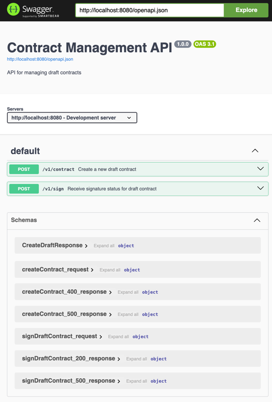

## Building / Running This Project

### Generating the sequence diagrams
You can regenerate it by running `make generateDiagrams`, which also produces `.svg` versions of the diagrams

### Running the REST services
To spin up the REST service, just run:
```sh
make run
```

and naviate to [localhost:8080](http://localhost:8080/ui/index.html):



This project can be built using [scala-cli](https://scala-cli.virtuslab.org/):
```sh
scala-cli ./src/main/scala
```

or with [sbt](https://www.scala-sbt.org/):
```sh
sbt run
```

## Building This Project

This project can be built using [scala-cli](https://scala-cli.virtuslab.org/):
```sh
scala-cli --power package ./src/main/scala --assembly -o app.jar
```

or with a zero-install docker build:
```sh
docker run --rm -v "${PWD}/src/main/scala:/home" virtuslab/scala-cli package /home --power --assembly -o /home/app.jar
```

or with [sbt](https://www.scala-sbt.org/):
```sh
sbt package
```