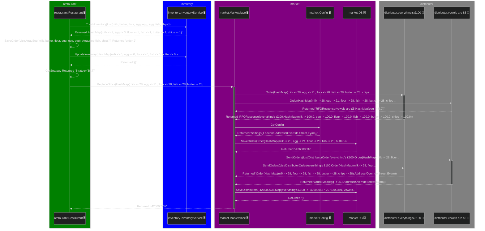

# Scenarios
This file was generated using [GenDocs](../jrm/src/test/scala/mermaid/GenDocs.scala)

To regenerate, run:
```sh
sbt test:run
```

## End to End

When given:
```scala
List(ArraySeq(milk, butter, flour, egg, egg, egg), ArraySeq(fish, chips))
```

This is what will happen:    




   