```mermaid
%%{init: {"theme": "dark", 
"themeVariables": {"primaryTextColor": "grey", "secondaryTextColor": "black", "fontFamily": "Arial", "fontSize": 14, "primaryColor": "#3498db"}}}%%
sequenceDiagram
	box green restaurant
	participant restaurant.Restaurant 🖥️
	end
	box blue inventory
	participant inventory.InventoryService 🖥️
	end
	box orange market
	participant market.Marketplace 🖥️
	end
	restaurant.Restaurant 🖥️ ->> inventory.InventoryService 🖥️ : CheckInventory(List(milk, butter, flour, egg, egg, egg, fish, chips))
	inventory.InventoryService 🖥️ -->> restaurant.Restaurant 🖥️ : Returned 'HashMap(milk -> 1, egg -> 3, flour -> 1, fish -> 1, butter -> 1, chips -> 1)'
	restaurant.Restaurant 🖥️ ->> restaurant.Restaurant 🖥️ : SaveOrder(List(ArraySeq(milk, butter, flour, egg, egg, egg), ArraySeq(fish, chips))) Returned 'order-2'
	restaurant.Restaurant 🖥️ ->> inventory.InventoryService 🖥️ : UpdateInventory(HashMap(milk -> 0, egg -> 0, flour -> 0, fish -> 0, butter -> 0, c...
	inventory.InventoryService 🖥️ -->> restaurant.Restaurant 🖥️ : Returned '()'
	restaurant.Restaurant 🖥️ ->> restaurant.Restaurant 🖥️ : GetStrategy Returned 'Strategy(3,7)'
	restaurant.Restaurant 🖥️ ->> market.Marketplace 🖥️ : ReplaceStock(HashMap(milk -> 7, flour -> 7, fish -> 7, butter -> 7, chips -> 7))
```

# Scenarios
This file was generated using [GenDocs](../jrm/src/test/scala/mermaid/GenDocs.scala)

To regenerate, run:
```sh
sbt test:run
```

## Restaurant

When given:
```scala
List(ArraySeq(milk, butter, flour, egg, egg, egg), ArraySeq(fish, chips))
```

This is what will happen:    




   

```mermaid
%%{init: {"theme": "dark", 
"themeVariables": {"primaryTextColor": "grey", "secondaryTextColor": "black", "fontFamily": "Arial", "fontSize": 14, "primaryColor": "#3498db"}}}%%
sequenceDiagram
	box green restaurant
	participant restaurant.Restaurant 🖥️
	end
	box blue inventory
	participant inventory.InventoryService 🖥️
	end
	box orange supplier
	participant supplier.Marketplace 🖥️
	end
	restaurant.Restaurant 🖥️ ->> inventory.InventoryService 🖥️ : CheckInventory(List(milk, butter, flour, egg, egg, egg, fish, chips))
	inventory.InventoryService 🖥️ -->> restaurant.Restaurant 🖥️ : Returned 'HashMap(milk -> 1, egg -> 3, flour -> 1, fish -> 1, butter -> 1, chips -> 1)'
	restaurant.Restaurant 🖥️ ->> restaurant.Restaurant 🖥️ : SaveOrder(List(ArraySeq(milk, butter, flour, egg, egg, egg), ArraySeq(fish, chips))) Returned 'order-2'
	restaurant.Restaurant 🖥️ ->> inventory.InventoryService 🖥️ : UpdateInventory(HashMap(milk -> 0, egg -> 0, flour -> 0, fish -> 0, butter -> 0, c...
	inventory.InventoryService 🖥️ -->> restaurant.Restaurant 🖥️ : Returned '()'
	restaurant.Restaurant 🖥️ ->> restaurant.Restaurant 🖥️ : GetStrategy Returned 'Strategy(3,7)'
	restaurant.Restaurant 🖥️ ->> supplier.Marketplace 🖥️ : ReplaceStock(HashMap(milk -> 7, flour -> 7, fish -> 7, butter -> 7, chips -> 7))
```

## Marketplace

When given:
```scala
Order(Map(eggs -> 3, brocoli -> 1),Address(unit,test,ave))
```

This is what will happen:    




   

```mermaid
%%{init: {"theme": "dark", 
"themeVariables": {"primaryTextColor": "grey", "secondaryTextColor": "black", "fontFamily": "Arial", "fontSize": 14, "primaryColor": "#3498db"}}}%%
sequenceDiagram
	box green market
	participant market.Marketplace 🖥️
	participant market.Config 🖥️
	participant market.DB 🗄️
	end
	box blue distributor
	participant distributor.vowels are £5 👤
	participant distributor.everything's £100 👤
	end
	market.Marketplace 🖥️ ->>+ distributor.vowels are £5 👤 : Order(Map(eggs -> 3, brocoli -> 1),Address(unit,test,ave))
	market.Marketplace 🖥️ ->> distributor.everything's £100 👤 : Order(Map(eggs -> 3, brocoli -> 1),Address(unit,test,ave))
	distributor.everything's £100 👤 -->> market.Marketplace 🖥️ : Returned 'RFQResponse(everything's £100,Map(eggs -> 100.0, brocoli -> 100.0))'
	distributor.vowels are £5 👤 -->>- market.Marketplace 🖥️ : Returned 'RFQResponse(vowels are £5,Map(eggs -> 5.0))'
	market.Marketplace 🖥️ ->> market.Config 🖥️ : GetConfig
	market.Config 🖥️ -->> market.Marketplace 🖥️ : Returned 'Settings(1 second,Address(Override,Street,Eyam))'
	market.Marketplace 🖥️ ->> market.DB 🗄️ : SaveOrder(Order(Map(eggs -> 3, brocoli -> 1),Address(unit,test,ave)))
	market.DB 🗄️ -->> market.Marketplace 🖥️ : Returned '-1271033017'
	market.Marketplace 🖥️ ->> distributor.vowels are £5 👤 : SendOrders(List(DistributorOrder(everything's £100,Order(Map(brocoli -> 1),Address...
	distributor.vowels are £5 👤 -->> market.Marketplace 🖥️ : Returned 'Order(Map(eggs -> 3),Address(Override,Street,Eyam))'
	market.Marketplace 🖥️ ->> distributor.everything's £100 👤 : SendOrders(List(DistributorOrder(everything's £100,Order(Map(brocoli -> 1),Address...
	distributor.everything's £100 👤 -->> market.Marketplace 🖥️ : Returned 'Order(Map(brocoli -> 1),Address(Override,Street,Eyam))'
	market.Marketplace 🖥️ ->> market.DB 🗄️ : SaveDistributors(-1271033017,Map(everything's £100 -> -1271033017--363833270, vowe...
```

## End to End

When given:
```scala
List(ArraySeq(milk, butter, flour, egg, egg, egg), ArraySeq(fish, chips))
```

This is what will happen:    




   